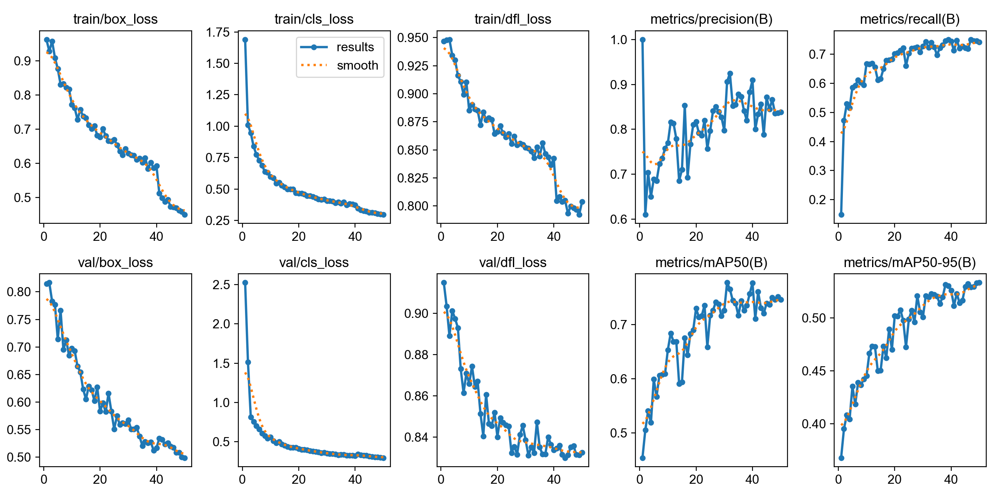
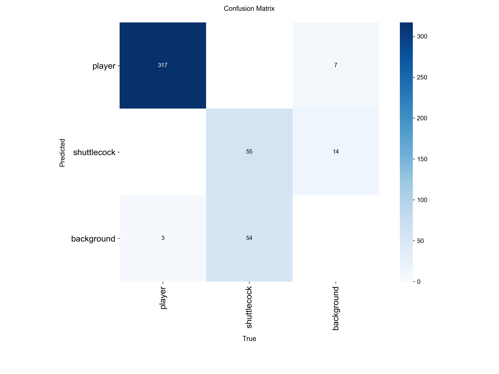

# BadmintonCV — Player & Shuttlecock Detection and Tracking

> Status: 🚧 In progress — fine-tuned detector + tracking pipeline

Computer vision system that detects and tracks players and the shuttlecock in badminton
match footage, using transfer learning (fine-tuning a pretrained YOLOv8 detector on a
domain-specific dataset) rather than training from scratch.

## Pipeline
1. **Fine-tuning** — start from YOLOv8n pretrained on COCO, fine-tune on a labeled
   badminton dataset (player + shuttlecock classes) from Roboflow Universe
2. **Detection + tracking** — run the fine-tuned model on video with ByteTrack to get
   persistent object IDs across frames, not just per-frame boxes
3. **Trajectory analysis** — extract the shuttlecock's height over time, use peak-finding
   to estimate hit points and basic rally structure

## Tech Stack
Python, Ultralytics YOLOv8, ByteTrack, OpenCV, NumPy, Pandas, scipy, matplotlib

## Dataset
Fine-tuned on a Roboflow Universe badminton dataset (player + shuttlecock classes,
CC BY 4.0 license). Not redistributed in this repo — see `dataset/README.md` for the
source link once downloaded.

## Project Structure
```
BadmintonCV/
├── scripts/
│   ├── 02_train_detector.py         # fine-tune YOLOv8 on the badminton dataset
│   ├── 03_track_and_overlay.py      # run detection + tracking on a video
│   └── 04_analyze_trajectory.py     # estimate hit points from shuttlecock trajectory
├── dataset/                         # Roboflow dataset, not tracked in git
├── videos/                          # raw clips, not tracked in git
├── data/                            # detections CSV, not tracked in git
├── outputs/                         # annotated video + charts, not tracked in git
├── requirements.txt
└── README.md
```

## Setup
```bash
pip install -r requirements.txt
# Download the Roboflow dataset (YOLOv8 format) into ./dataset/ first
python scripts/02_train_detector.py
python scripts/03_track_and_overlay.py runs/badminton_finetune/weights/best.pt videos/your_clip.mp4
python scripts/04_analyze_trajectory.py
```

## Current Status (honest, not aspirational)
- ✅ Detector fine-tuned on a public badminton dataset (player + shuttlecock)
- ✅ Detection + tracking pipeline running on real footage, annotated video output
- ✅ Basic trajectory analysis — heuristic hit-point estimation via peak-finding
- 📋 Not yet implemented: pose estimation / motion comparison against a benchmark
  athlete. This was the original scope but was deprioritized to focus on getting a
  complete, working detection-and-tracking pipeline given a short timeline — a
  natural next phase once this foundation is solid.
- 📋 Not yet implemented: court calibration / real-world coordinate mapping,
  automated shot-type classification

## Known Limitations
- Fine-tuned on a relatively small, single-source dataset — may not generalize well
  to camera angles, lighting, or courts very different from the training data
- Tracking can lose an ID during fast motion (smashes) or occlusion between players
- Hit-point estimation is heuristic (peak-finding on trajectory), not a learned model

## Progress Log
- Fine-tuned YOLOv8n on a Roboflow badminton dataset; built detection + tracking +
  trajectory analysis pipeline on personal footage.

## Baseline: single combined model (before splitting player/shuttlecock)

Before switching to the 2-model architecture, the original model trained on
both classes at once showed a clear imbalance in results:

| Class | mAP50 | mAP50-95 | Instances |
|---|---|---|---|
| Player | 0.994 | 0.904 | 1092 |
| Shuttlecock | 0.508 | 0.163 | 387 |
| All classes | 0.751 | - | - |




**Key finding from the confusion matrix:** 54/68 background cases were
misclassified as shuttlecock — showing the problem wasn't just low recall,
but also a high false-positive rate. This was the direct evidence that led
to the decision to split into two dedicated models (see the "Two separate
models" section below).