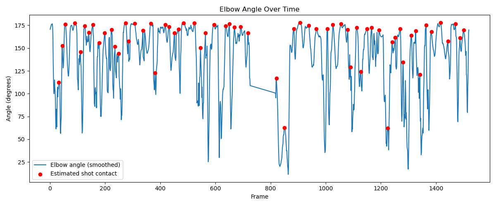
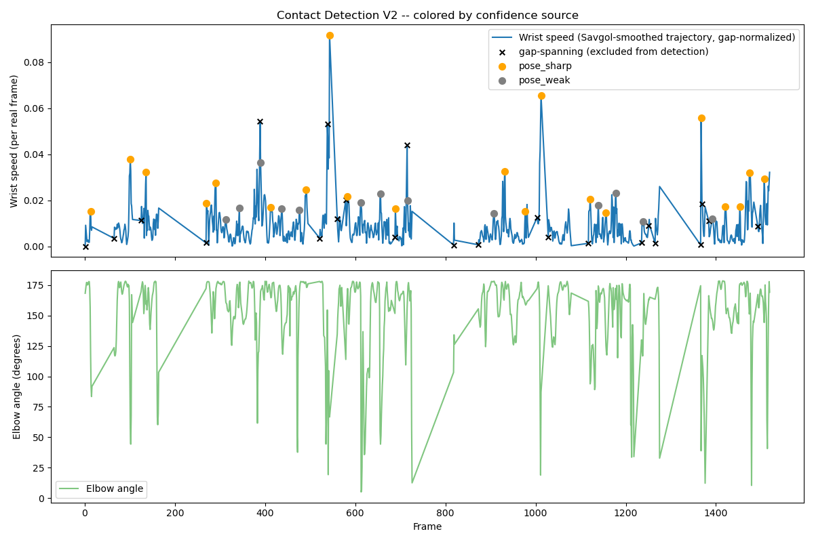

# BadmintonCV

A computer vision pipeline for analyzing badminton match footage: detecting
players and the shuttlecock, estimating shot contact moments from pose data,
and a proof-of-concept shot-type classifier.

This project intentionally has a narrower scope than a full "badminton
tactical analysis" system. It's built as a portfolio piece to demonstrate
practical CV/ML skills — object detection, pose estimation, signal
processing, and a PyTorch training pipeline — while being honest about
what's a solid working component versus what's a heuristic approximation of
a research-level problem.

---

## What's implemented

### 1. Player & shuttlecock detection (YOLOv8)

Two separate YOLOv8 models, trained via transfer learning from COCO
pretrained weights, rather than one shared model:

| Model | Base | Image size | mAP50 | mAP50-95 |
|---|---|---|---|---|
| `player_only-2` | yolov8n | 640 | 0.995 | — |
| `shuttlecock_only` | yolov8s | 1280 | 0.815 | 0.455 |

Splitting into two single-class models improved shuttlecock detection
significantly over a shared 2-class model (mAP50 0.508 → 0.815) — the
shuttlecock is a small, fast-moving object and benefits from a higher input
resolution and a model not competing with the player-detection task.

Dataset: [Roboflow — badminton-players-detection](https://roboflow.com)
(`hongy20/badminton-players-detection`), split into two single-class
datasets with `scripts/01_split_dataset_by_class.py`.

`scripts/03_track_and_overlay.py` runs both models on a video and overlays:
- Player boxes labeled "Player Near" / "Player Far" (by vertical position —
  track IDs weren't used, since they were unstable across occlusions)
- Shuttlecock position as a marker, with `conf=0.5` to reduce false
  positives from stage lighting being misread as the shuttlecock

### 2. Pose extraction (MediaPipe)

`scripts/06_pose_extraction.py` runs MediaPipe Pose over the full video and
exports 33 landmarks per frame to `data/pose_landmarks.csv`.

> **Note:** MediaPipe `1.0.1` has a native bug on Apple Silicon
> (`Check failed: service_ Service is unavailable`). Pinned to
> `mediapipe==0.10.30` in `requirements.txt`.

### 3. Shot contact detection: v1 → v2

**v1 (`scripts/07_calculate_angles.py`):** looked for peaks in either elbow
angle or raw wrist speed between consecutive frames.



Most "estimated contacts" cluster near ~175° elbow angle — i.e. the arm was
nearly *straight*, which happens naturally at rest, not just during a
swing. Peak elbow extension alone isn't a reliable signal for contact
timing.

Switching v1 to wrist speed instead didn't fully fix it either — it was
still fooled by:
- **Noisy landmarks during fast motion.** MediaPipe loses confidence exactly
  when the racket arm moves fastest (motion blur, racket occlusion), and a
  couple of misread frames looks identical to a real speed spike.
- **Dropped frames read as instant motion.** When low-confidence frames were
  skipped, diffing across the gap collapsed several frames' worth of motion
  into what looked like "one frame" of movement — producing extreme fake
  speed values. In this dataset, **12 of the 15 highest "speed" readings
  from v1 were this artifact**, not real swings.
- **One global threshold for the whole video**, which can't tell a soft net
  shot from noise during a fast rally.

**v2 (`scripts/08_calculate_contacts_v2.py`)** addresses all three:

1. Drops low-confidence landmark readings (MediaPipe `visibility` score)
   before computing anything.
2. Smooths the wrist **trajectory** (Savitzky-Golay) before differentiating,
   instead of smoothing the noisy speed signal after the fact.
3. Normalizes speed by the actual number of elapsed frames, and only trusts
   a sample as instantaneous when it spans a real, unbroken frame pair —
   directly removing the gap-artifact false positives.
4. Requires a genuine "still → burst" pattern: looks backward from each
   candidate peak for a stillness point, and only keeps it if the rise was
   fast and sharp. Gradual speed-ups (footwork, repositioning) are rejected.
5. *(Optional)* Fuses with audio onset detection (`librosa`) — matched
   candidates are snapped to the audio timestamp and marked higher
   confidence (`pose+audio`); unmatched ones are labeled by confidence tier
   (`pose_sharp` / `pose_weak`) rather than treated as equally certain.



The black ✕ marks are exactly the gap-artifact false positives described
above — several sit right where v1 would have read the highest speed peaks.
Orange/gray dots show the confidence tiers used to flag candidates for
review.

**Still a heuristic, not a trained detector.** v2 is more robust than v1,
but it's threshold-based, not learned. The published state of the art for
this problem fuses shuttle-trajectory reversal near a player (via a tracked
shuttle detector) with pose signals, reaching ~90% accuracy — that requires
a shuttle tracker this project doesn't build. v1 is kept in git history for
reference; it isn't used in the final pipeline.

### 4. Shot type classification (PyTorch, proof-of-concept)

`scripts/09_train_shot_classifier.py` — a small MLP (`nn.Module`, 1 hidden
layer) trained on the v2 contact candidates: features are `wrist_speed`,
`windup_frames`, `elbow_angle`; labels are hand-assigned by watching the
video at each candidate's timestamp (`not_shot` / `push` / `smash`).

The goal here wasn't classification accuracy — it was to demonstrate a real
PyTorch pipeline: `Dataset`/`DataLoader`, a training loop, proper
train/test split, and feature standardization fit only on the training set.

**Setup:** 33 hand-labeled samples, 75/25 train/test split.

**Result:** Training accuracy climbed to 96%, while test accuracy actually
*dropped* over training (56% → 33%). That's textbook overfitting — with 33
samples across 3 imbalanced classes (17 / 11 / 5), the model memorized the
training examples instead of learning a generalizable pattern.

This isn't hidden or "fixed" with an artificially favorable split — it's
reported as-is, because correctly diagnosing overfitting from the training
curves is the actual point of this section, not the accuracy number.

### 5. End-to-end demo (`scripts/10_run_on_video.py`)

Chains everything above into one pipeline: given a raw video, it runs pose
extraction, detects contact candidates, classifies each one with the
trained MLP, and renders a new video with the predicted shot label
overlaid at each detected moment.

**Scope note:** this is offline batch processing (analyzes the full video,
then renders output), not real-time / live camera inference — the contact
detection logic needs to look both forward and backward in the wrist
trajectory to find still→burst patterns, so it can't run as a live stream
without being restructured for online-only signal processing. Also, since
the classifier was trained on 33 samples from one clip, predictions on a
different video should be read as a demo of the pipeline working
end-to-end, not as validated accuracy.

---

## Known Limitations

- **Shot contact detection is heuristic, not learned.** It relies on tuned
  thresholds (percentiles, windup windows) rather than a trained model.
- **Shot classification does not generalize.** 33 hand-labeled samples is
  far too small to train a model that works on new footage.
- **No shuttle tracking yet.** Shuttlecock detection exists per-frame
  (YOLOv8), but there's no trajectory tracker, so hit detection can't use
  shuttle direction-reversal — the highest-accuracy signal in published
  approaches.
- **Tactical position recommendation is not implemented as a learned
  system.** Any such feature in this project is a simple heuristic, not a
  model trained on match outcomes — building a real one is an open research
  problem (player positioning optimization from video).
- **Single-video, single-condition dataset.** Everything above was tuned
  and evaluated on one clip; performance on different courts, camera
  angles, or lighting is untested.

## Roadmap

- Build a shuttlecock trajectory tracker (e.g. TrackNetV3) and fuse
  direction-reversal near a player with the existing pose-based candidates
- Collect and label contact/shot-type data across multiple matches to make
  the PyTorch classifier meaningful
- Add shuttle-trajectory features to the classifier once a tracker exists
- Revisit tactical recommendation as a clearly-scoped heuristic (e.g.
  court-zone coverage suggestions) rather than a learned system, unless
  enough labeled match data becomes available

---

## Setup

```bash
git clone https://github.com/RiePham/BadmintonCV.git
cd BadmintonCV
pip install -r requirements.txt
```

Requires `ffmpeg` on `PATH` if using the optional audio fusion in
`08_calculate_contacts_v2.py`.

## Project structure

```
BadmintonCV/
├── data/                   # landmark CSVs, shot feature CSVs
├── outputs/                # rendered videos, charts, trained model weights
├── scripts/
│   ├── 01_split_dataset_by_class.py
│   ├── 02_train_player.py
│   ├── 02_train_shuttlecock.py
│   ├── 03_track_and_overlay.py
│   ├── 06_pose_extraction.py
│   ├── 08_calculate_contacts_v2.py
│   ├── 09_train_shot_classifier.py
│   └── 10_run_on_video.py   # end-to-end demo: video in -> annotated video out
└── requirements.txt
```